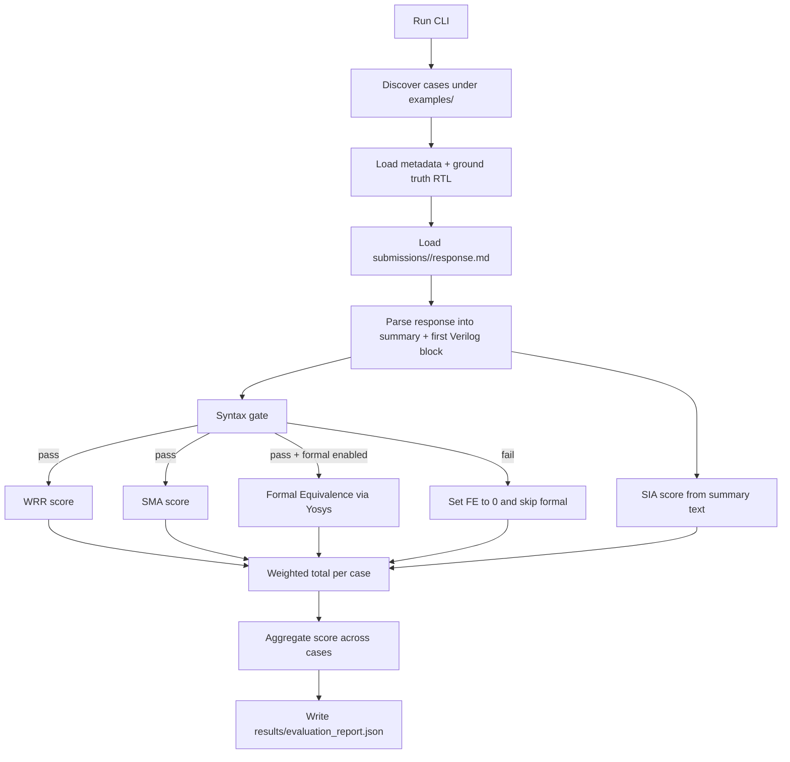

# GateLift-Bench Operator Manual

This page explains exactly how the benchmark executes, where each stage lives in code, and how to modify it safely.

## 1) Execution Flow

## 2) File Responsibilities

1. Entry point and argument handling
   - [run_benchmark.py](../run_benchmark.py)
   - Builds configuration and launches evaluation.

2. Main orchestration per case and full benchmark
   - [gatelift_bench/evaluator.py](../gatelift_bench/evaluator.py)
   - Matches example case ids to submission folders.
   - Applies metric weights and emits final JSON report.

3. Response parsing and syntax checks
   - [gatelift_bench/parser.py](../gatelift_bench/parser.py)
   - Extracts first fenced Verilog block and summary text.
   - Runs syntax check: Verilator, then Icarus, then builtin fallback.

4. Structural and semantic metrics
   - [gatelift_bench/metrics.py](../gatelift_bench/metrics.py)
   - WRR: bus-signature F1.
   - SMA: operator profile and graph-shape proxy.
   - SIA: keyword coverage plus summary-token Jaccard.

5. Verilog feature extraction helpers
   - [gatelift_bench/verilog_utils.py](../gatelift_bench/verilog_utils.py)
   - Bus declarations, module names, operator counters, shape features.

6. Formal equivalence engine
   - [gatelift_bench/formal.py](../gatelift_bench/formal.py)
   - Yosys equiv flow.
   - Returns binary FE score and notes.

7. Data model definitions
   - [gatelift_bench/models.py](../gatelift_bench/models.py)
   - Dataclasses for parsed artifacts, metrics, and run config.

8. Case generation utility
   - [tools/generate_case_from_rtl.py](../tools/generate_case_from_rtl.py)
   - Converts source RTL into benchmark case using Yosys flattening.

9. Testbench coverage
   - [tests/test_benchmark.py](../tests/test_benchmark.py)
   - Parser tests, metric sanity tests, report generation tests.

## 3) Scoring Equations

Per-case weighted total:

$$
\text{Total} = 0.10 \cdot \text{Syntax} + 0.20 \cdot \text{WRR} + 0.25 \cdot \text{SMA} + 0.35 \cdot \text{FE} + 0.10 \cdot \text{SIA}
$$

Where:

$$
\text{WRR} = F1 = \frac{2PR}{P+R}
$$

$$
\text{SIA} = 0.6 \cdot \text{keyword\_score} + 0.4 \cdot \text{jaccard}
$$

Aggregate benchmark score is the arithmetic mean of per-case totals.

## 4) Safe Extension Guide

1. Add a new metric
   - Implement metric function in [gatelift_bench/metrics.py](../gatelift_bench/metrics.py).
   - Add metric field in [gatelift_bench/models.py](../gatelift_bench/models.py) if needed.
   - Integrate scoring path in [gatelift_bench/evaluator.py](../gatelift_bench/evaluator.py).
   - Add unit tests in [tests/test_benchmark.py](../tests/test_benchmark.py).

2. Replace heuristic syntax fallback
   - Modify [gatelift_bench/parser.py](../gatelift_bench/parser.py).
   - Keep tool order stable to preserve determinism.

3. Adjust metric weights
   - Update defaults in [gatelift_bench/evaluator.py](../gatelift_bench/evaluator.py) or pass custom config.
   - Re-run benchmark and compare report deltas in [results/evaluation_report.json](../results/evaluation_report.json).

4. Add new benchmark cases
   - Use [tools/generate_case_from_rtl.py](../tools/generate_case_from_rtl.py) or manually add under [examples](../examples).
   - Provide matching submission under [submissions](../submissions).

## 5) Operations Checklist

1. Run tests first:
   - `python -m unittest discover -s tests -p "test_*.py"`

2. Run benchmark:
   - `python run_benchmark.py --examples examples --submissions submissions --results results/evaluation_report.json`

3. Containerized run:
   - `docker compose run --rm benchmark`

4. Verify report:
   - [results/evaluation_report.json](../results/evaluation_report.json)

## 6) Common Failure Modes

1. FE score always 0
   - Formal disabled (`--no-formal`) or Yosys missing in runtime.

2. Syntax score unexpectedly 0
   - Candidate response formatting not preserved.
   - Parser consumed wrong block because of multiple code blocks.

3. Case scored all zeros
   - Missing submission folder or wrong case id alignment.
